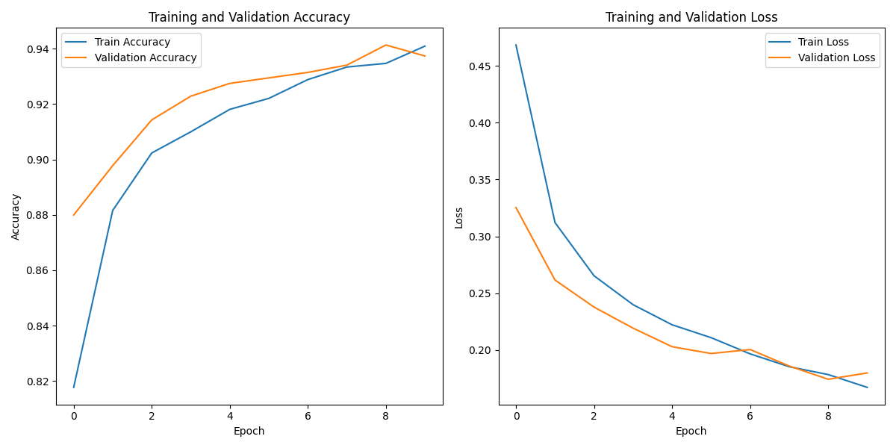

# 🩺 X-RayGuard: Pulmonary Disease Detection System  

**X-RayGuard** is an AI-powered system for detecting lung diseases from chest X-ray images. It classifies images into three categories: **COVID-19**, **Viral Pneumonia**, and **Normal**. Built with TensorFlow and Gradio, this project provides a comprehensive pipeline for medical image analysis, from preprocessing to explainable predictions.  

---

## ✨ Key Features  
- **Disease Classification**: Detects COVID-19, Viral Pneumonia, and Normal cases.  
- **Explainable AI**: Integrated Grad-CAM visualization to highlight decision-critical regions.  
- **Interactive Web Interface**: User-friendly Gradio app for real-time predictions.  
- **Transfer Learning**: Uses MobileNetV2 for efficient feature extraction.  
- **Detailed Metrics**: Confusion matrices, classification reports, and training history plots.  

---

## 🚀 Quick Start  

### Prerequisites  
- Python 3.8+  
- TensorFlow 2.x  
- OpenCV, NumPy, Gradio  

### Installation  
1. Clone the repository:  
   ```bash  
   git clone https://github.com/RaitonRed/X-RayGuard.git  
   cd X-RayGuard  
   ```
2. Installing Dependency's
   ```bash
   pip install -r requirements.txt
   ```
3. Run the web app
   ```bash
   cd src
   python run.py
   ```
---
## 📂 Project Structure
   ```
   X-RayGuard/
   ├── .env/
   ├── data/
   ├── models/
   ├── notebooks/
   ├── results/
   ├── src/
   │    ├── interface/
   │    │   ├── __init__.py
   │    │   ├── app.py
   │    │   └── functions.py 
   │    ├── __init__.py
   │    ├── data_preprocessing.py
   │    ├── evaluate.py
   │    ├── grad_cam.py
   │    ├── options.py
   │    ├── predict.py
   │    ├── run.py
   │    └── train.py
   ├── .gitignore
   ├── LICENSE
   ├── README.md
   ├── requirements.txt
   ├── research_requirements.txt
   ```
---
## 🔍 Dataset
This project uses the [COVID-19 Radiography Dataset](https://www.kaggle.com/tawsifurrahman/covid19-radiography-database).
Organize the dataset as follows:

```
data/
├── COVID
├── NORMAL
└── VIRAL PNEUMONIA
```

---

## 📊 Model Performance

- Accuracy: **93.7%** (on test data)
- Confusion Matrix: 
- Training Curves: 

---

## 🛠️ Usage Examples
1. Train the model:
```bash
python train.py
```
2. Generate Grad-CAM heatmaps:
```bash
python grad_cam.py --image path/to/image.png --save output.png  
```
3. Evaluate the model:
```bash
python evaluate.py
```
---
## 🤝 Contributing
Contributions are welcome!

   - Report bugs via [GitHub Issues](https://github.com/RaitonRed/X-RayGuard/issues).
   - Suggest improvements or open a Pull Request.
   - Improve documentation or add new features.
---
## 📜 License
This project is licensed under the MIT License. See [LICENSE](https://github.com/RaitonRed/X-RayGuard/blob/main/LICENSE) for details.

---
Made with ❤️ by Raiton.

🔗 [GitHub Repository](https://github.com/RaitonRed/X-RayGuard) | 💬 [Ask a Question](https://github.com/RaitonRed/X-RayGuard/discussions)